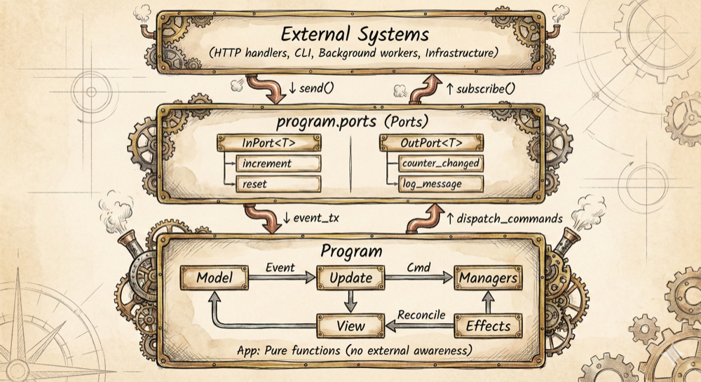

# Saucer Documentation

This directory contains the complete documentation for Saucer - The Elm Architecture for Rust.

## System Overview

*The complete architecture showing how applications, effect managers, and the runtime work together. [Full resolution version](assets/system_overview-full.png)*

## Quick Navigation

### Getting Started

New to Saucer? Start with the [main README](../README.md) which explains the core concepts and shows a complete example.

### Architecture Reference

Deep-dive into Saucer's design and implementation:

- **[Effect Managers](architecture/effect-managers.md)** - Creating and using effect managers
- **[Observability](architecture/observability.md)** - Event/command/self-msg logging and filtering
- **[Ports](architecture/ports.md)** - Bidirectional communication with external systems

### Guides

Step-by-step tutorials for common tasks *(coming soon)*:

- **Getting Started Guide** - Build your first Saucer app
- **Effect Managers Guide** - Creating custom effect managers
- **Testing Guide** - Testing strategies

## Internal References

For contributors working on Saucer itself:

- **[PORTING_EFFECT_MANAGERS](../../docs/PORTING_EFFECT_MANAGERS.md)** - Internal guide for porting effect managers

## Examples

See the test fixtures for working examples:

- [mock_app](../saucer-core/tests/mock_app/) - Basic app with HTTP
- [mock_port_app](../saucer-core/tests/mock_port_app/) - Ports example
- [mock_wrapper_app](../saucer-core/tests/mock_wrapper_app/) - Wrapper composition

## Contributing

Documentation improvements are welcome! Please ensure:

- Examples use `#[tokio::main]` async pattern
- Command examples prefer variant constructors over closures
- No references to internal "Vandura" naming in public docs
- Follow the established architecture doc structure (individual component docs)
